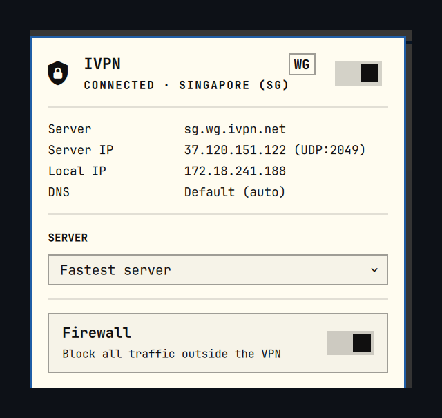

# Proton VPN — Omarchy bar widget

A bar-widget plugin for [Omarchy](https://omarchy.org/) that drives
[Proton VPN](https://www.protonvpn.com) from the top bar: connect, disconnect, pause,
pick a server, and see where your traffic comes out on a world map.



## Requirements

- Omarchy with the Quickshell plugin system (`omarchy plugin` / `omarchy bar`).
- The IVPN client installed, providing `ivpn` on `PATH`, with `ivpn-service`
  running:

  ```bash
  systemctl status ivpn-service
  ```

- A logged-in account. The widget cannot create one; log in once with:

  ```bash
  ivpn login ACCOUNT_ID
  ```

  Until then the widget shows "Not logged in" and the switch is inert.

The plugin shells out to `ivpn` only (`status`, `servers`, `connect`,
`disconnect`, `connection -pause/-resume`, `firewall`, `antitracker`). It needs
no elevated access, bundles no binaries, and never handles your Account ID.

It reads two files it does not own, both read-only:

- `~/.config/IVPN/ivpn-settings.json` — the IVPN desktop app's settings, for
  exact server coordinates. The daemon's `servers.json` has them too but is
  `0600 root`.
- `/usr/share/zoneinfo/zone.tab` — public-domain timezone coordinates.

The only file it writes is `~/.config/omarchy/ivpn-widget.json`, holding the
selected server and, if you enable the lookup below, your cached public address.

## Use

- **Left click** — open the panel.
- **Middle click** — connect/disconnect without opening.
- **Right click** — refresh.

In the panel: `c` connect/disconnect, `p` pause/resume, `f` firewall,
`a` AntiTracker, `r` refresh, `Esc` close.

### Map

Home and the tunnel exit are plotted on an equirectangular world with an arc
between them; multi-hop draws both legs. The land raster is generated from
[Natural Earth](https://www.naturalearthdata.com/) 1:110m land polygons, which
are public domain, and is embedded — the map needs no network and no map
library.

Exit coordinates come from IVPN's own data, falling back to a `zone.tab` city
lookup. **Your** position is the reference city of your system timezone unless
you turn on the public-IP lookup, and the panel says which of the two it is
rather than implying a precision it does not have.

### Pause

`ivpn connection -pause` suspends the tunnel for a set number of minutes and
restores it by itself, which a plain disconnect will not do. One button is
rendered per entry in `pauseDurations`, and while paused they are replaced by a
single **Resume**.

### Firewall

The **Firewall** toggle is IVPN's kill switch (`ivpn firewall -on|-off`), which
blocks all traffic outside the tunnel. Enabling it while disconnected cuts your
connectivity until you connect, so that direction asks for confirmation first;
turning it off never does.

## Settings

Per widget, in `~/.config/omarchy/shell.json`:

| Key | Default | Meaning |
| --- | --- | --- |
| `refreshIntervalSec` | `5` | How often `ivpn status` is polled (2–60). |
| `protocol` | `WireGuard` | Which protocol to list servers for and connect with. `WireGuard` or `OpenVPN`. |
| `pauseDurations` | `5,15,30` | Durations offered as pause buttons. Up to four, each 1–1440 minutes. |
| `publicIpLookup` | `false` | See below. |

IVPN publishes a separate hostname per protocol (`sg.wg.ivpn.net` versus
`sg.gw.ivpn.net`), so the list is filtered to one rather than showing each city
twice. If the setting ever matches nothing, the widget lists every server
instead of showing an empty picker.

### `publicIpLookup`

Off by default, and the widget's **only** network request. When on, it asks
`https://api.ivpn.net/v4/geo-lookup` what address the internet sees, and shows
your real city and ISP on the map instead of the timezone estimate.

The reply carries an `isIvpnServer` flag, so the widget can tell your own
address from the tunnel exit rather than inferring it from connection state. A
lookup made while connected necessarily reports the exit, so your own address is
only recorded during a disconnected moment and then cached; while connected the
panel says "hidden by the tunnel" rather than showing a stale value as current.

This is the setting to turn on if you travel. The timezone estimate is only as
right as your system clock, and a laptop carried to another country without
changing its clock will keep claiming the old city. A fresh lookup happens on
every connect and disconnect, so the position corrects itself the first time the
tunnel goes down in the new place. The cached reading is shown with its age
(`203.0.113.45 · 2d ago`) so a stale one is visible as stale.

Note that the **Tunnel IP** in the details is the address IVPN assigns you
*inside* the tunnel. It is the same wherever you are and says nothing about
your location; the same goes for your LAN address.

## IPC

```bash
omarchy-shell artemisa81.ivpn status       # Connected / Paused / Disconnected / ...
omarchy-shell artemisa81.ivpn toggle       # open or close the panel
omarchy-shell artemisa81.ivpn connect
omarchy-shell artemisa81.ivpn disconnect
omarchy-shell artemisa81.ivpn pause
omarchy-shell artemisa81.ivpn resume
omarchy-shell artemisa81.ivpn refresh
```

## Remove

```bash
omarchy plugin disable artemisa81.ivpn
rm -rf ~/.config/omarchy/plugins/artemisa81.ivpn ~/.config/omarchy/ivpn-widget.json
```

## Credits

World land raster derived from [Natural Earth](https://www.naturalearthdata.com/)
(public domain). Timezone coordinates from the IANA time zone database
(public domain).
